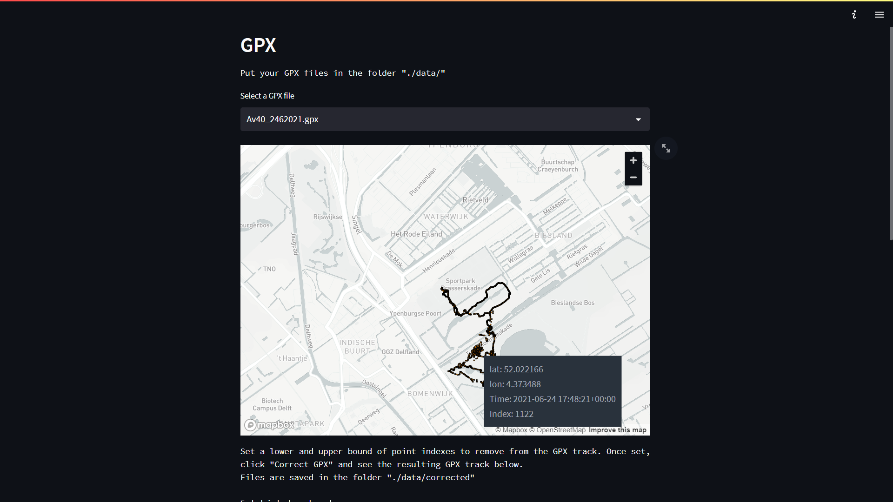
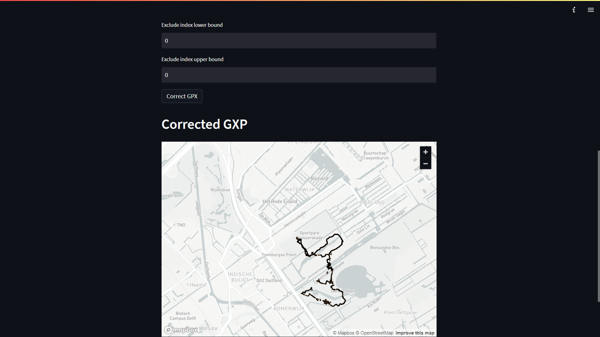

# Tool to view and manipulate GPX tracks

Streamlit dashboard to view GPX tracks and remove points from the track.

## Usage

Install requirements:  
`pip install -r requirements.txt`

Create a `data` folder in the repository rootdirectory and add gpx files

Run the Streamlit dashboard:  
`streamlit run dashboard.py`

Remove points from your GPX track by selecting the lower and upper bound
indexes of points to remove (see tooltip for index) and click `Correct GPX`

